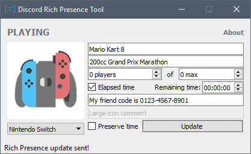
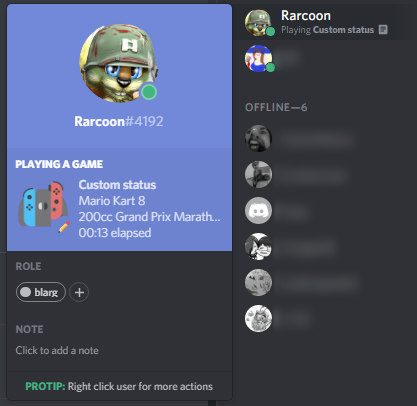

# Discord Rich Presence Tool
A C++/Qt program that lets you fill in your own custom Discord Rich Presence information for games and activities away from the PC.

### Note
The Discord API only allows you to update your Rich Presence information once every 15 seconds. (https://discordapp.com/developers/docs/topics/rate-limits)

## Screenshots

## Download
You can find the latest compiled releases here: https://github.com/Rarcoon/Discord-Rich-Presence-Tool/releases

## Requirements (developers only)
- Qt Open Source Edition
https://www.qt.io/

- Discord RPC
https://github.com/discordapp/discord-rpc

## Feedback
If you would like to provide feedback or suggest new icons, you can contact me on Twitter ([@N6T4_](https://twitter.com/n6t4_ "@N6T4_")).
